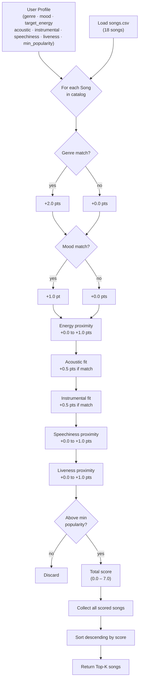

# 🎵 Music Recommender Simulation

## Project Summary

In this project you will build and explain a small music recommender system.

Your goal is to:

- Represent songs and a user "taste profile" as data
- Design a scoring rule that turns that data into recommendations
- Evaluate what your system gets right and wrong
- Reflect on how this mirrors real world AI recommenders

Replace this paragraph with your own summary of what your version does.

---

## How The System Works

Explain your design in plain language.

Some prompts to answer: In my system, a Song stores an ID, title, and three audio features: valence, danceability, and acousticness. The UserProfile stores a user's preferred genre, preferred mood, target energy level, and a liked_acousticness value that signals whether the user gravitates toward acoustic or electronic-sounding tracks. The Recommender works in two stages. First, it scores an individual song against a user's profile using the scoring logic defined in my algorithm. This keeps the scoring function focused and single-purpose — one song, one user, one score. That score is then consumed by a separate ranking function, which evaluates the full song catalog and surfaces the best matches for the user. This separation of scoring and ranking mirrors how real-world recommendation systems are architected — keeping each responsibility isolated and independently testable. At scale, real-world systems combine content-based filtering with collaborative filtering — learning from the behavior of millions of users to surface songs you haven't heard but listeners like you love. This simulation intentionally skips that layer and focuses only on audio feature similarity, which is a simpler but more transparent starting point.

- What features does each `Song` use in your system
  - For example: genre, mood, energy, tempo
- What information does your `UserProfile` store
- How does your `Recommender` compute a score for each song
- How do you choose which songs to recommend

You can include a simple diagram or bullet list if helpful.

---

### Algorithm Recipe

| Rule | Points |
|---|---|
| `song.genre == user.favorite_genre` | **+2.0** |
| `song.mood == user.favorite_mood` | **+1.0** |
| Energy proximity: `1.0 - abs(song.energy - user.target_energy)` | **0.0 – 1.0** |
| Acoustic fit: matches `likes_acoustic` preference (threshold 0.6) | **+0.5** |
| Instrumental fit: matches `prefers_instrumental` preference (threshold 0.6) | **+0.5** |
| Speechiness proximity: `1.0 - abs(song.speechiness - user.target_speechiness)` | **0.0 – 1.0** |
| Liveness proximity: `1.0 - abs(song.liveness - user.target_liveness)` | **0.0 – 1.0** |
| **Maximum possible score** | **7.0** |
| Song below `min_popularity` | **filtered out** |

The weights were chosen so that genre is the strongest signal (a 2× premium over mood), because listeners most reliably reject songs outside their preferred genre. Energy is a continuous bonus that breaks ties between genre/mood matches. Acoustic and instrumental fit are small tie-breakers since those preferences are binary and highly personal. Speechiness and liveness use the same proximity formula as energy — the closer the song's value to the user's target, the higher the bonus — rewarding songs that match how spoken-word-heavy or live-sounding the user prefers their music.

---

### Data Flow Diagram



---

### Expected Biases

- **Genre over-prioritization.** A genre match alone (2.0 pts) outscores a perfect mood + energy combination (1.0 + 1.0 = 2.0). A song that fits the vibe but belongs to the wrong genre will always rank at or below genre-matched songs, even if it would be a better listening experience.
- **Exact-string genre/mood matching.** "indie pop" and "pop" are treated as completely different genres, so similar-sounding categories receive no partial credit. This could cause the system to miss relevant songs.
- **Small catalog amplifies genre gaps.** With only 18 songs, some genres (e.g., blues, classical, country) have just one entry. A user who prefers those genres will receive genre-match points for at most one song, making energy/mood proximity the only differentiator for the rest of the list.
- **Popularity filter skews toward mainstream.** Setting `min_popularity` too high could silently exclude niche but well-matched songs (e.g., the ambient and classical tracks with popularity 54–59).

---

## Getting Started

## Screenshots


### Setup

1. Create a virtual environment (optional but recommended):

   ```bash
   python -m venv .venv
   source .venv/bin/activate      # Mac or Linux
   .venv\Scripts\activate         # Windows

2. Install dependencies

```bash
pip install -r requirements.txt
```

3. Run the app:

```bash
python -m src.main
```

### Running Tests

Run the starter tests with:

```bash
pytest
```

You can add more tests in `tests/test_recommender.py`.

---

## Experiments You Tried

Use this section to document the experiments you ran. For example:

- What happened when you changed the weight on genre from 2.0 to 0.5
- What happened when you added tempo or valence to the score
- How did your system behave for different types of users

---

## Limitations and Risks

Summarize some limitations of your recommender.

Examples:

- It only works on a tiny catalog
- It does not understand lyrics or language
- It might over favor one genre or mood

You will go deeper on this in your model card.

---

## Reflection

Read and complete `model_card.md`:

[**Model Card**](model_card.md)

Write 1 to 2 paragraphs here about what you learned:

- about how recommenders turn data into predictions
- about where bias or unfairness could show up in systems like this


---

## 7. `model_card_template.md`

Combines reflection and model card framing from the Module 3 guidance. :contentReference[oaicite:2]{index=2}  

```markdown
# 🎧 Model Card - Music Recommender Simulation

## 1. Model Name

Give your recommender a name, for example:

> VibeFinder 1.0

---

## 2. Intended Use

- What is this system trying to do
- Who is it for

Example:

> This model suggests 3 to 5 songs from a small catalog based on a user's preferred genre, mood, and energy level. It is for classroom exploration only, not for real users.

---

## 3. How It Works (Short Explanation)

Describe your scoring logic in plain language.

- What features of each song does it consider
- What information about the user does it use
- How does it turn those into a number

Try to avoid code in this section, treat it like an explanation to a non programmer.

---

## 4. Data

Describe your dataset.

- How many songs are in `data/songs.csv`
- Did you add or remove any songs
- What kinds of genres or moods are represented
- Whose taste does this data mostly reflect

---

## 5. Strengths

Where does your recommender work well

You can think about:
- Situations where the top results "felt right"
- Particular user profiles it served well
- Simplicity or transparency benefits

---

## 6. Limitations and Bias

Where does your recommender struggle

Some prompts:
- Does it ignore some genres or moods
- Does it treat all users as if they have the same taste shape
- Is it biased toward high energy or one genre by default
- How could this be unfair if used in a real product

---

## 7. Evaluation

How did you check your system

Examples:
- You tried multiple user profiles and wrote down whether the results matched your expectations
- You compared your simulation to what a real app like Spotify or YouTube tends to recommend
- You wrote tests for your scoring logic

You do not need a numeric metric, but if you used one, explain what it measures.

---

## 8. Future Work

If you had more time, how would you improve this recommender

Examples:

- Add support for multiple users and "group vibe" recommendations
- Balance diversity of songs instead of always picking the closest match
- Use more features, like tempo ranges or lyric themes

---

## 9. Personal Reflection

A few sentences about what you learned:

- What surprised you about how your system behaved
- How did building this change how you think about real music recommenders
- Where do you think human judgment still matters, even if the model seems "smart"

